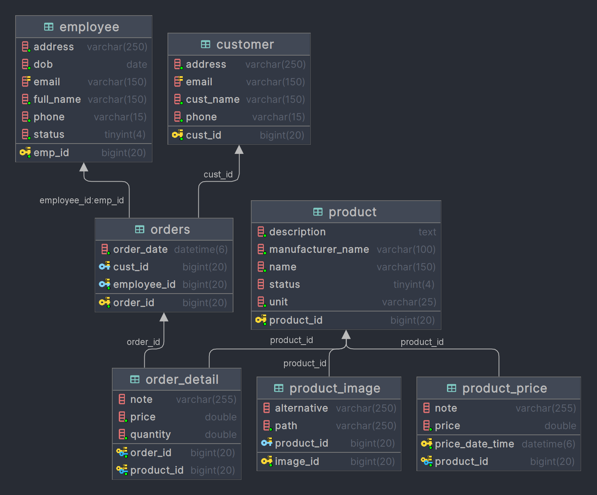
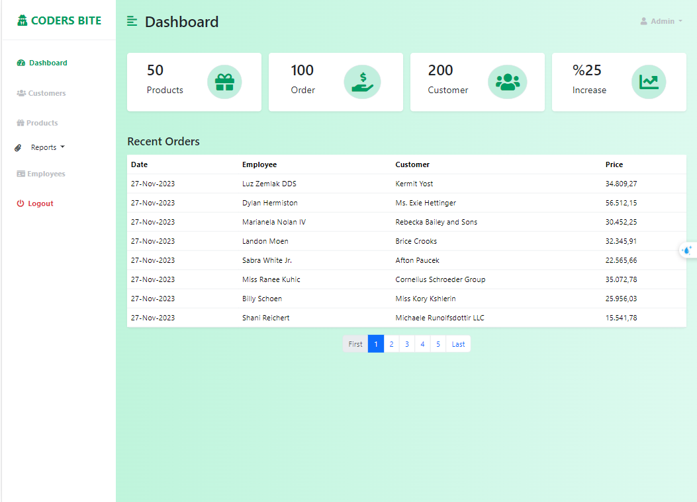
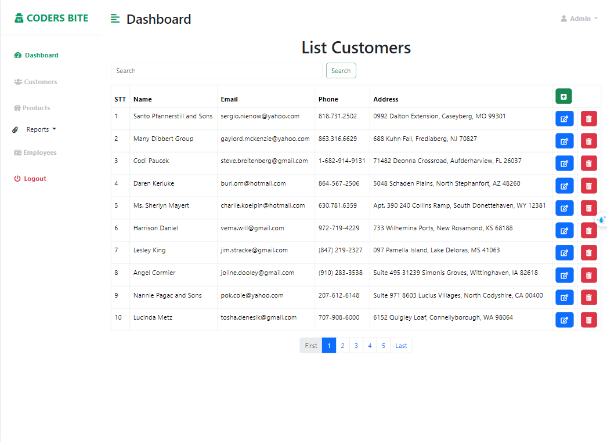
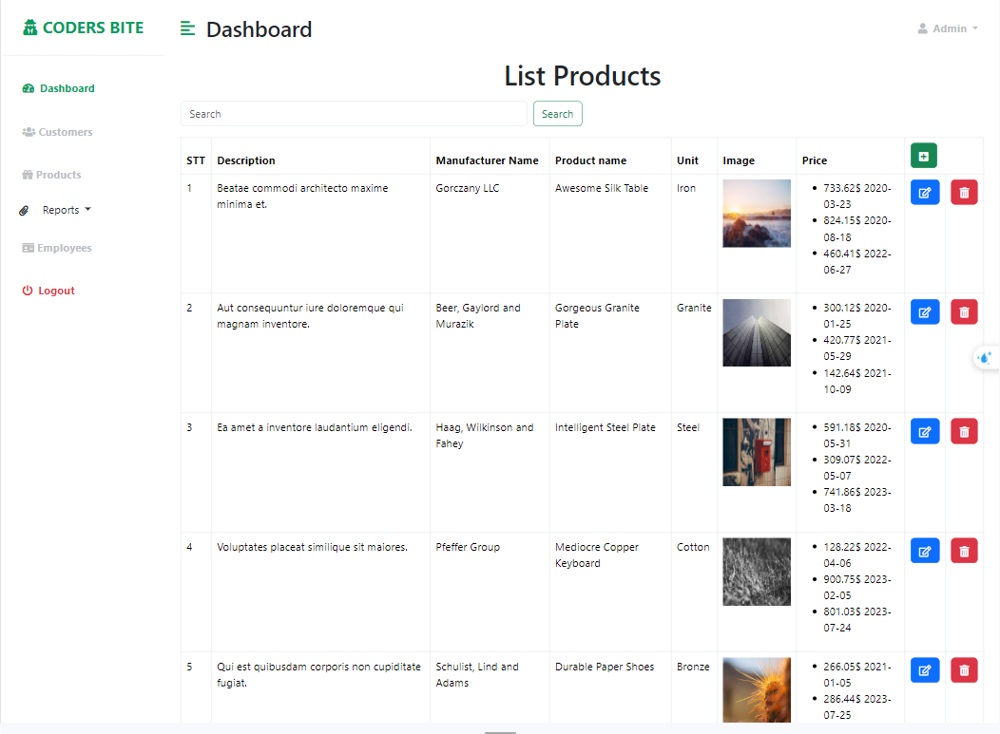
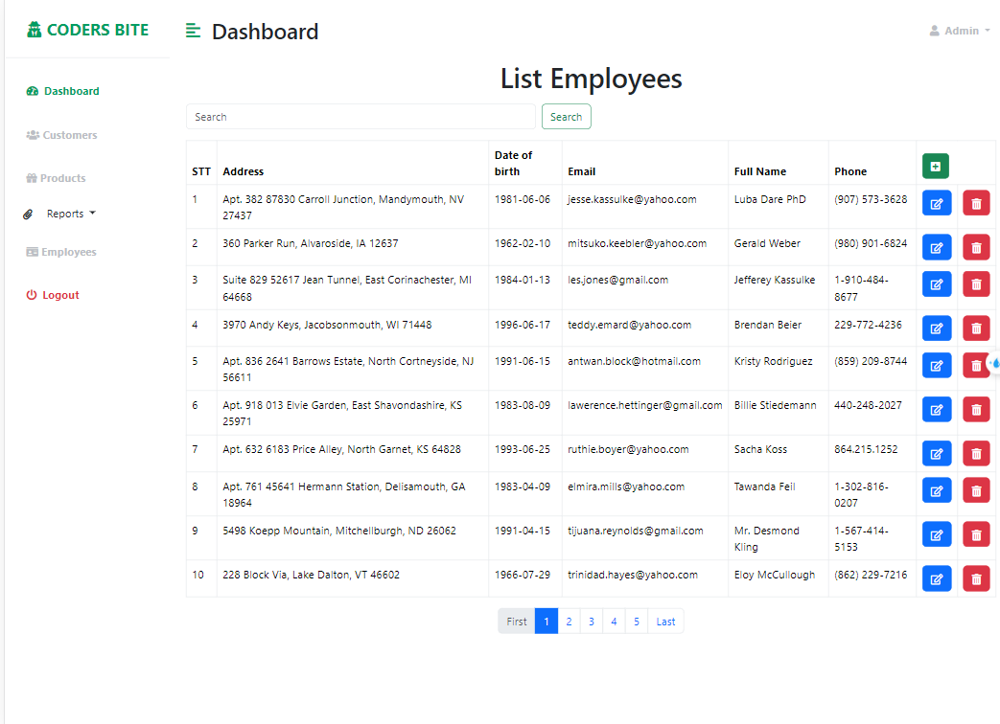
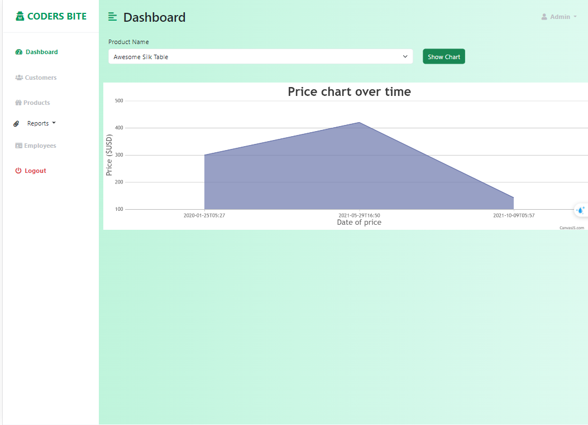
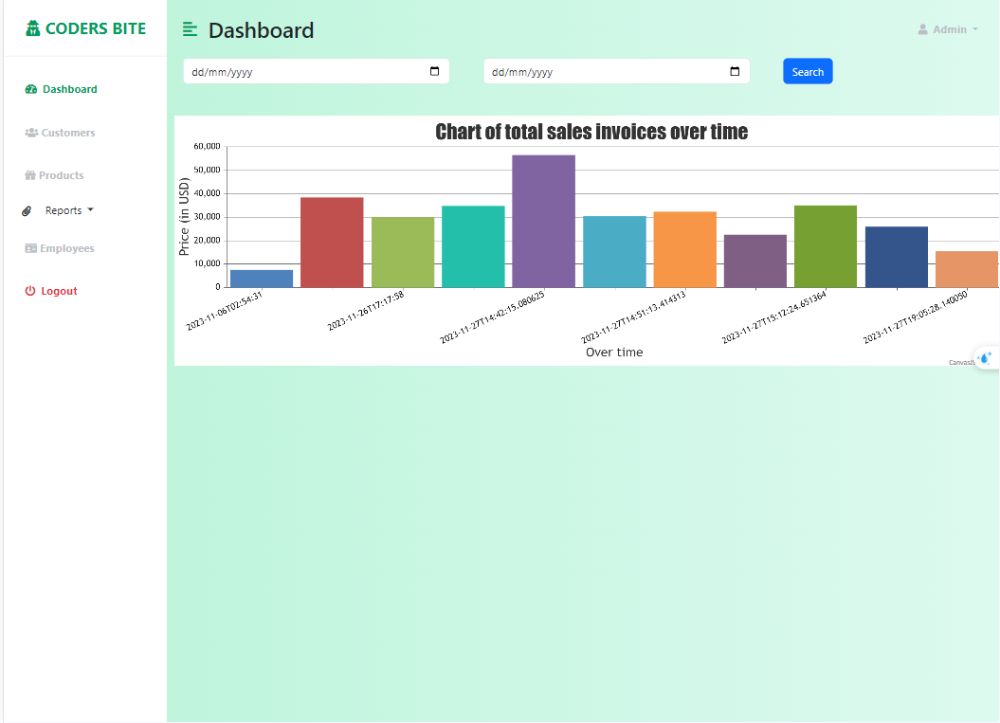
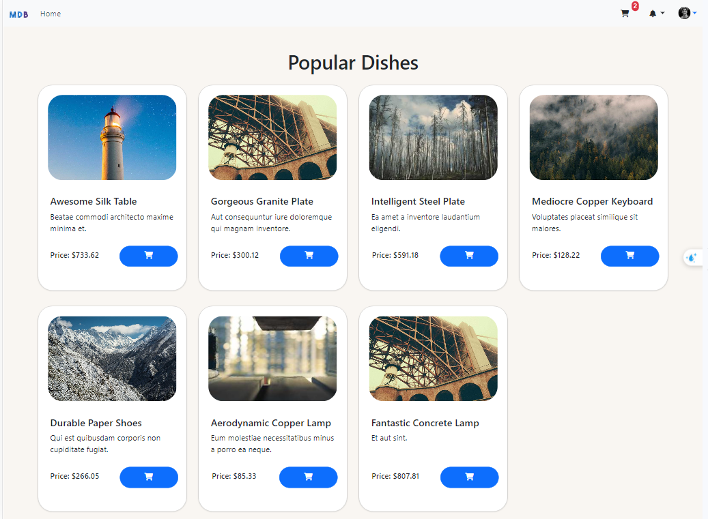
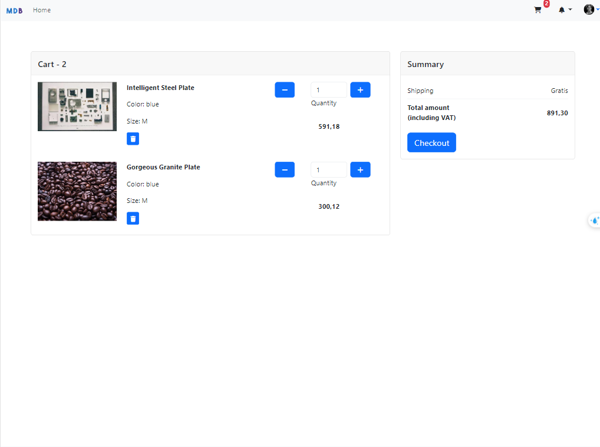

# WWW-NguyenVietBac-Lab07
# 💻 Công nghệ và công cụ sử dụng
     
### Giới thiệu chương trình
Website bán hàng cung cấp cho khách hàng một cách đơn giản và tối ưu hóa công việc bán hàng của một
cung cấp nhiều chức năng, mang lại trải nghiệm mua hàng thú vị cho khách hàng.
### Sơ đồ database của hệ thống

### Các chức năng của chương trình
- Quản lý nhân viên
- Quản lý khách hàng
- Quản lý hóa đơn
- Quản lý sản phẩm
- Thống kê doanh thu theo một mốc thời gian
- Thống kê giá theo thời gian của sản phẩm
- Đặt hàng, thanh toán
#### Trang của admin

### Trang quản lý khách hàng

### Trang quản lý sản phẩm

### Trang quản lý nhân viên

### Trang thống kê giá theo thời gian của sản phẩm

### Trang thống kê doanh thu của các hóa đơn theo ngày

### Trang đặt hàng

### Trang thanh toán

